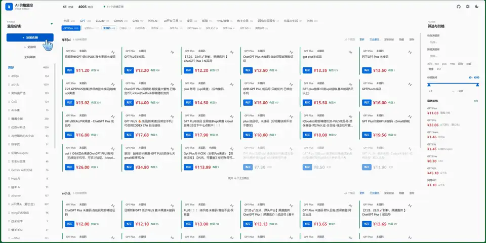
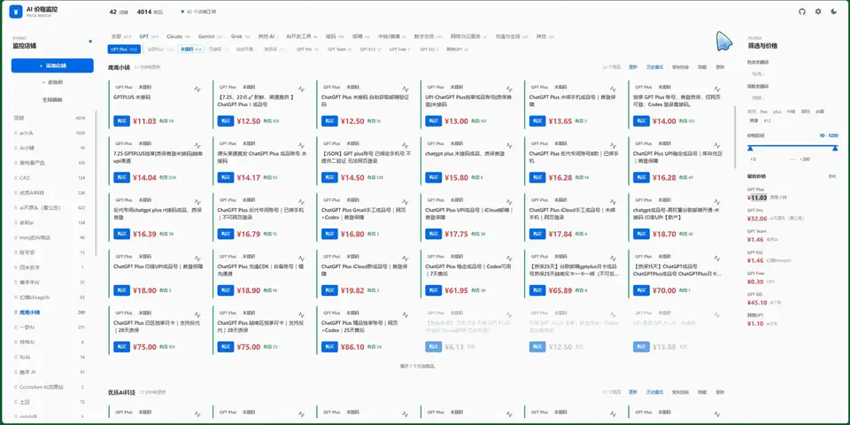
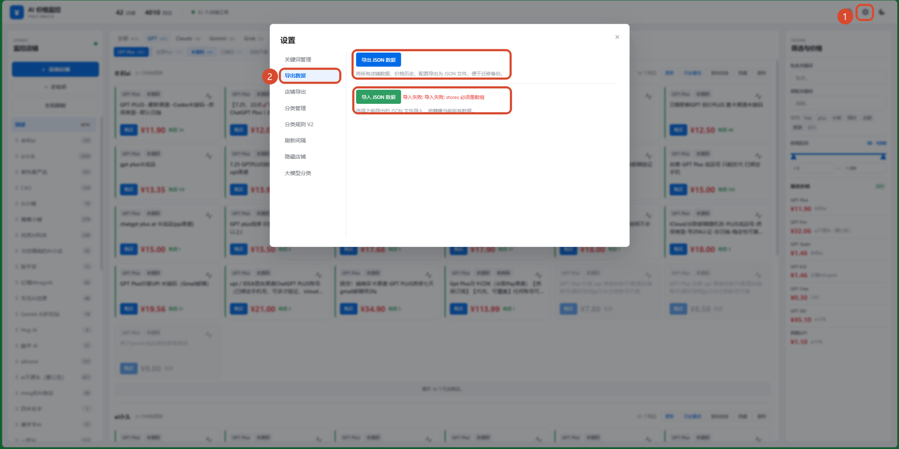
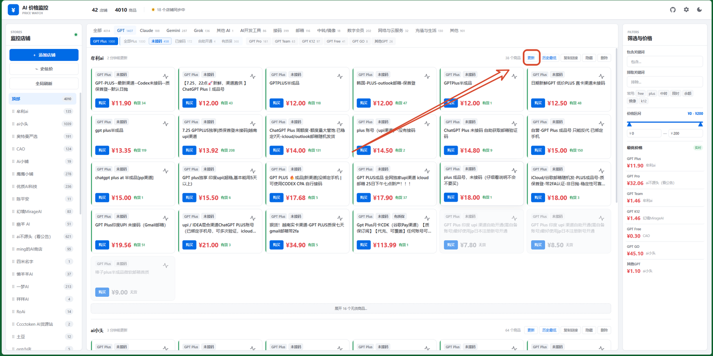
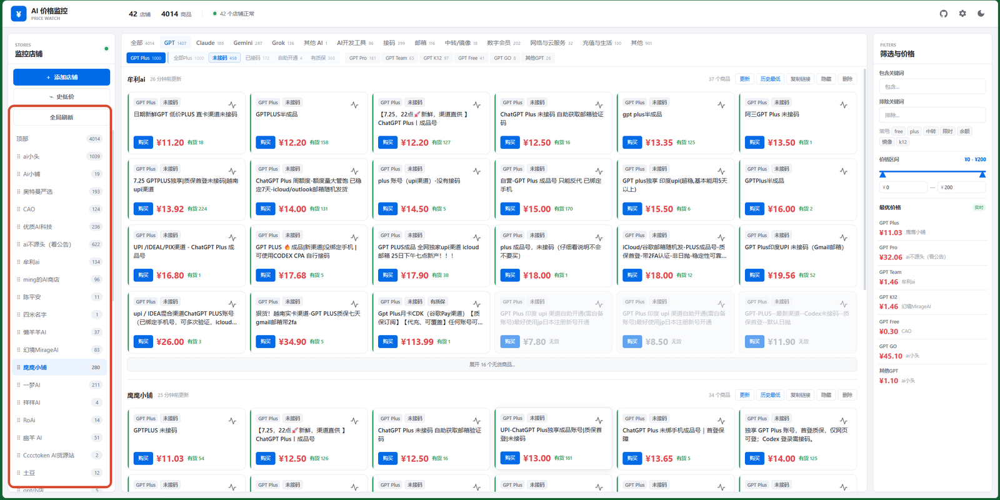
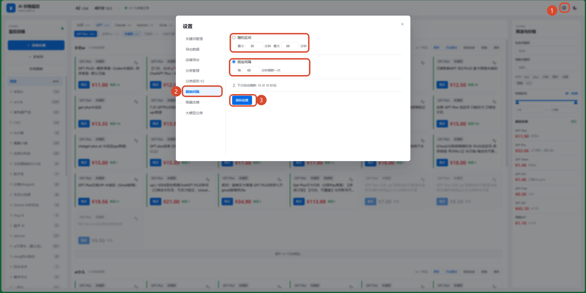
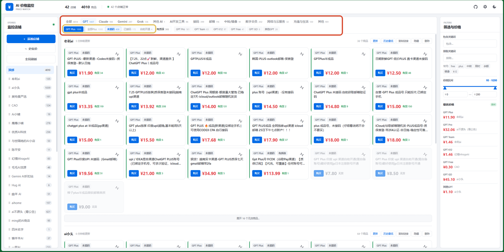
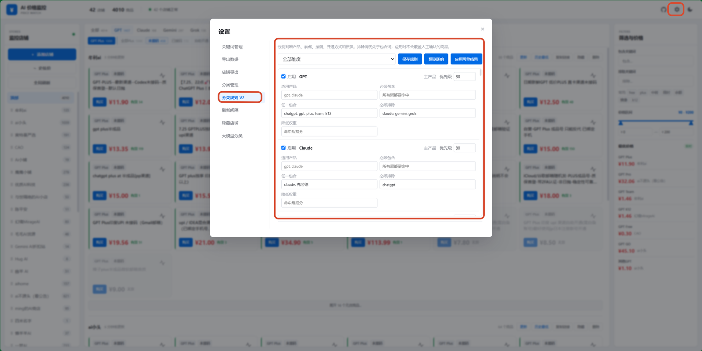
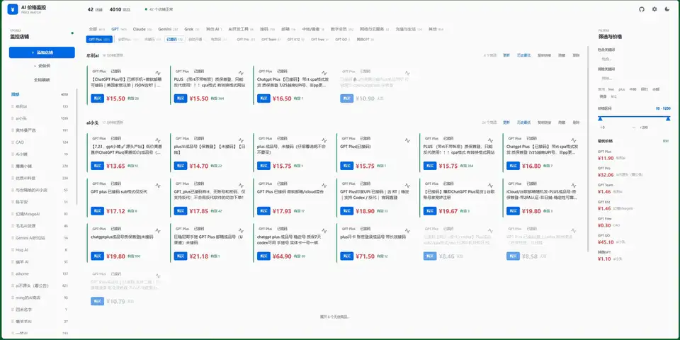
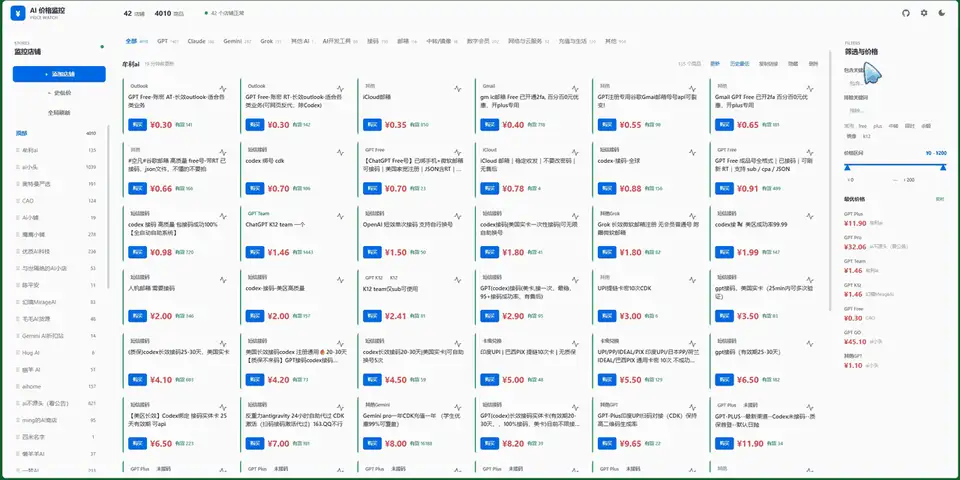

# AI Price Monitor 使用说明

## 1. 主要功能

- 添加店铺并监控商品价格和库存变化。
- 自动或手动分类商品，方便筛选和比价。
- 记录商品历史价格，查看价格走势和历史最低价。

## 2. 添加店铺

### 2.1 手动添加

点击左侧的“添加店铺”，输入店铺链接。目前仅支持链动小铺（`pay.ldxp.cn`）。添加成功后，店铺会显示在店铺列表末尾。

### 2.2 从文件导入

1. 点击右上角的“设置”。
2. 找到“店铺导入导出”。
3. 点击“导入店铺列表”并选择文件。
4. 等待店铺信息刷新完成。若刷新长时间没有进展，可刷新页面后重试，或点击“全局刷新”。

如需店铺列表文件，可联系作者：QQ `2087629236`，邮箱 `kirk-yang@qq.com`。

完成店铺添加后，即可使用主要的监控、筛选和比价功能。

### 2.3 完整数据导入导出

设置中可以导入或导出店铺及其历史数据，适合备份数据或迁移到其他设备。历史数据会持续更新，如需现成数据也可以联系作者。

## 3. 刷新机制

刷新任务按单队列依次执行。系统默认自动选择轻量接口或浏览器会话，并记住店铺最近成功的采集方式。目标站出现 JavaScript 验证时，系统会停止剩余任务并进入冷却，不会继续逐店重试。

### 3.1 单店铺刷新

需要立即查看某个店铺的最新价格时，可点击该店铺的更新按钮。刷新失败不会删除上次成功获取的商品，店铺卡片会显示失败原因。

### 3.2 全局刷新

点击左侧“刷新设置”，可执行全部店铺的 GPT 重点刷新，覆盖 GPT Plus 与 GPT K12。任务按当前店铺顺序执行，已经存在的全局批次完成或停止前不能重复创建。

若采集通道已熔断，新任务会直接提示稍后重试，不会显示虚假的排队进度。“重置请求计数”只清空本小时预算，不能提前解除上游风控冷却。

### 3.3 定时刷新

- 自动巡检只将超过设定周期且尚未刷新的店铺加入队列。
- 低价 Plus 店铺优先按基础周期刷新，其他店铺使用更长周期。
- 采集通道不可用时，自动巡检会跳过本轮并等待冷却结束。

修改刷新设置后，请点击“保存参数”。默认使用“自动选择”，通常不需要手动修改采集方式。

## 4. 商品分类

### 4.1 分类结构

当前分类主要依赖本地规则，分为以下层级：

- 一级分类：GPT、Claude、Gemini、Grok 等产品系列。
- 二级分类：各产品系列下的具体套餐或类型。
- Plus 细分：针对 GPT Plus 的接码、开通方式和质保等属性进一步筛选。

### 4.2 分类管理

在“设置 → 分类管理”中，可以添加和调整分类规则、修改分类顺序及控制分类是否显示。完善包含词和排除词可以提高自动分类的准确度。

### 4.3 手动归类

点击商品卡片左上角的分类标签，可以手动修改商品分类。手动分类结果会被保留，不会被后续的自动分类覆盖。

### 4.4 包含与排除搜索

搜索支持同时设置包含词和排除词，可用于快速筛选符合条件的商品。

## 支持项目

如果这个项目对你有帮助，欢迎在 [GitHub](https://github.com/kirk-y/ai-price-monitor) 点一个 Star。
